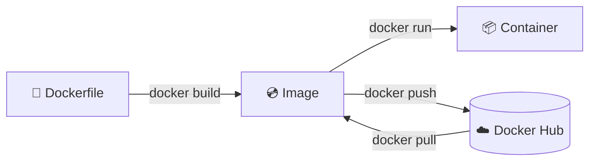
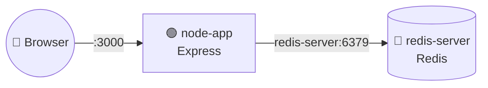
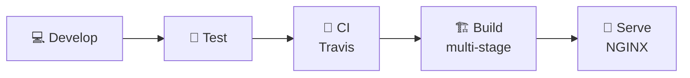
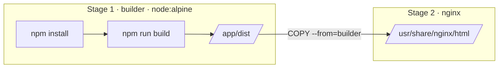
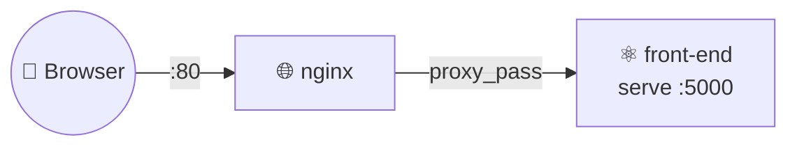

<div align="center">

# 🐳 Docker Learning Notes

**A hands-on journey from `docker run` to production-grade workflows**

[](https://www.docker.com/)
[](https://docs.docker.com/compose/)
[](https://nodejs.org/)
[](https://redis.io/)
[](https://nginx.org/)
[](https://kubernetes.io/)

</div>

---

## 📖 About

This repo is my personal notebook for learning **Docker**. Each folder is a small, runnable
example that builds on the previous one — starting with basic CLI commands and ending with
multi-stage builds, NGINX, CI with Travis, and an intro to Kubernetes.

## 🗂️ Projects

| # | Folder | What you'll learn | Stack |
| :-: | :-- | :-- | :-- |
| 1 | [`redis-image`](./redis-image) | Write your first `Dockerfile`, build & tag an image | Alpine, Redis |
| 2 | [`real-project`](./real-project) | Containerize a Node app, port mapping, `WORKDIR`, layer caching | Node.js, Express |
| 3 | [`multiple-container`](./multiple-container) | Run multiple services with Docker Compose, restart policies | Express, Redis |
| 4 | [`production-grade-workflow`](./production-grade-workflow) | Dev volumes, tests in containers, multi-stage builds, NGINX, CI | React, Vite, NGINX, Travis CI |

## 🎓 Learning Path — Basic to Advanced

Go deeper with the step-by-step guides in [`docs/`](./docs). Each chapter ends with a ✅ checkpoint.

| # | Chapter | Level | Topics |
| :-: | :-- | :-: | :-- |
| 01 | [Getting Started](./docs/01-getting-started.md) | 🟢 Beginner | Containers vs VMs, architecture, lifecycle, `docker run` flags, cleanup |
| 02 | [Images](./docs/02-images.md) | 🟢 Beginner | Layers, tags, Docker Hub, choosing a base image |
| 03 | [Dockerfile Deep Dive](./docs/03-dockerfile.md) | 🟢 Beginner | All instructions, `CMD` vs `ENTRYPOINT`, `ARG` vs `ENV`, `.dockerignore`, caching |
| 04 | [Data & Volumes](./docs/04-data-and-volumes.md) | 🟡 Intermediate | Named volumes, bind mounts, tmpfs, backup & restore |
| 05 | [Networking](./docs/05-networking.md) | 🟡 Intermediate | Network drivers, DNS by name, publishing ports, reaching the host |
| 06 | [Docker Compose in Depth](./docs/06-docker-compose.md) | 🟡 Intermediate | Full-stack app, healthchecks, `.env`, profiles, overrides, `compose watch` |
| 07 | [Best Practices & Security](./docs/07-best-practices-and-security.md) | 🔴 Advanced | Non-root, hardening, secrets, vulnerability scanning, 12-factor |
| 08 | [Debugging & Troubleshooting](./docs/08-debugging.md) | 🔴 Advanced | Logs, inspect, exit codes, common problems |
| 09 | [Advanced Docker](./docs/09-advanced.md) | 🔴 Advanced | BuildKit cache & secrets, multi-platform, resource limits, PID 1, logging |
| 10 | [CI/CD & Orchestration](./docs/10-cicd-and-orchestration.md) | 🔴 Advanced | GitHub Actions, Docker Swarm, Kubernetes |

## 📑 Table of Contents

- [🎓 Learning Path](#-learning-path--basic-to-advanced)
- [🧠 Core Concepts](#-core-concepts)
- [⚡ CLI Cheat Sheet](#-cli-cheat-sheet)
- [🏗️ 1. Building a Custom Image](#️-1-building-a-custom-image)
- [📦 2. Containerizing a Node.js App](#-2-containerizing-a-nodejs-app)
- [🧩 3. Docker Compose — Multiple Containers](#-3-docker-compose--multiple-containers)
- [🏭 4. Production-Grade Workflow](#-4-production-grade-workflow)
  - [Development with Volumes](#-development-with-volumes)
  - [Running Tests](#-running-tests)
  - [Multi-Stage Builds](#-multi-stage-builds)
  - [Continuous Integration with Travis CI](#-continuous-integration-with-travis-ci)
  - [NGINX](#-nginx)
- [☸️ 5. Kubernetes Intro](#️-5-kubernetes-intro)
- [📚 Resources](#-resources)

---

## 🧠 Core Concepts

| Term | Meaning |
| :-- | :-- |
| **Image** | A read-only template (filesystem snapshot + startup command) used to create containers |
| **Container** | A running instance of an image — an isolated process with its own filesystem & network |
| **Dockerfile** | A recipe of instructions that tells Docker how to build an image |
| **Docker Hub** | A public registry where images are stored and shared |
| **Docker Compose** | A tool for defining and running multi-container apps with a single YAML file |



---

## ⚡ CLI Cheat Sheet

### Container lifecycle

| Command | Description |
| :-- | :-- |
| `docker run <image>` | Create **and** start a container from an image |
| `docker create <image>` | Create a container (without starting it) |
| `docker start -a <container-id>` | Start a container (`-a` attaches to its output) |
| `docker ps` | List running containers |
| `docker ps -a` | List **all** containers, including stopped ones |
| `docker stop <container-id>` | Gracefully stop a container (`SIGTERM`, then `SIGKILL` after 10s) |
| `docker kill <container-id>` | Immediately stop a container (`SIGKILL`) |
| `docker logs <container-id>` | Show the output of a container |
| `docker system prune` | 🧹 Remove stopped containers, unused networks, dangling images & build cache |

### Working inside a container

```sh
docker exec -it <container-id> <command>
```

> `-i` keeps STDIN open, `-t` allocates a terminal. Common shells to use as `<command>`:
> `sh` · `bash` · `zsh` · `powershell`

```sh
# Example: open a shell inside a running container
docker exec -it <container-id> sh

# Example: start a new container straight into a shell
docker run -it alpine sh
```

---

## 🏗️ 1. Building a Custom Image

📁 [`redis-image`](./redis-image)


📄 **`Dockerfile`**

```dockerfile
# Use an existing docker image as a base
FROM alpine

# Download and install a dependency
RUN apk add --update redis

# Tell the image what to do when it starts as a container
CMD ["redis-server"]
```

Build and run:

```sh
docker build .
docker run <image-id>
```

### 🏷️ Tagging an image

Instead of copying image IDs around, give the image a name:

```sh
# docker build -t <docker-id>/<repo-name>:<version> .
docker build -t n4sunday/redis:latest .

docker run n4sunday/redis
```

### 📝 Dockerfile instructions used in this repo

| Instruction | Purpose |
| :-- | :-- |
| `FROM` | Base image to start from |
| `WORKDIR` | Set the working directory for the following instructions |
| `COPY` | Copy files from the build context into the image |
| `RUN` | Execute a command while **building** the image |
| `CMD` | Default command to run when the **container starts** |

---

## 📦 2. Containerizing a Node.js App

📁 [`real-project`](./real-project)

```
real-project
├── 📄 Dockerfile
├── 📄 index.js
└── 📄 package.json
```

<details>
<summary>📄 <b>index.js</b></summary>

```js
const express = require("express");

const app = express();

app.get("/", (req, res) => {
  res.send("Hello World");
});

app.listen(3000, () => {
  console.log("Listen on port 3000");
});
```

</details>

<details>
<summary>📄 <b>package.json</b></summary>

```json
{
  "name": "real-project",
  "version": "1.0.0",
  "main": "index.js",
  "scripts": {
    "start": "node index.js"
  },
  "dependencies": {
    "express": "*"
  }
}
```

</details>

### Step 1 — A first (broken) attempt ❌

```dockerfile
FROM node:alpine

RUN npm install

CMD ["npm", "start"]
```

> [!WARNING]
> This fails: `package.json` only exists on **your machine**, not inside the image.
> We need to `COPY` our source files in before running `npm install`.

### Step 2 — Copy the project files ✅

```dockerfile
FROM node:alpine

COPY ./ ./
RUN npm install

CMD ["npm", "start"]
```

`COPY <src> <dest>`

| Argument | Meaning |
| :-- | :-- |
| `<src>` `./` | Path on **your machine**, relative to the build context |
| `<dest>` `./` | Path **inside the container** |

### Step 3 — Port mapping 🔌

Containers are isolated, so incoming traffic must be explicitly forwarded:

```sh
# docker run -p <host-port>:<container-port> <image>
docker run -p 3000:3000 <image-id>
```

Then open 👉 http://localhost:3000

### Step 4 — Set a working directory 📂

Copying into `/` can overwrite system folders. Use `WORKDIR` to keep things tidy:

```dockerfile
FROM node:alpine

WORKDIR /usr/app

COPY ./ ./
RUN npm install

CMD ["npm", "start"]
```

### Step 5 — Leverage the layer cache ⚡

Every change to `index.js` used to trigger a full `npm install`. Copy `package.json`
**first**, so dependencies are only reinstalled when they actually change:

```dockerfile
FROM node:alpine

WORKDIR /usr/app

# 1. Install dependencies (cached unless package.json changes)
COPY ./package.json ./
RUN npm install

# 2. Copy the rest of the source code
COPY ./ ./

CMD ["npm", "start"]
```

> [!TIP]
> Order your Dockerfile from **least** frequently changed to **most** frequently changed.

---

## 🧩 3. Docker Compose — Multiple Containers

📁 [`multiple-container`](./multiple-container)

Docker Compose lets you:

- 🚀 Start up multiple containers at the same time
- ✂️ Replace long `docker run` arguments with a single YAML file
- 🌐 Put all services on a shared network — they can reach each other **by service name**



```
multiple-container
├── 📄 Dockerfile
├── 📄 docker-compose.yml
├── 📄 index.js
└── 📄 package.json
```

<details>
<summary>📄 <b>index.js</b> — a visit counter backed by Redis</summary>

```js
const express = require("express");
const redis = require("redis");

const app = express();
const client = redis.createClient({
  host: "redis-server", // 👈 the service name from docker-compose.yml
  port: 6379,
});
client.set("visits", 0);

app.get("/", (req, res) => {
  client.get("visits", (err, visits) => {
    res.send("Number of visits is " + visits);
    client.set("visits", +visits + 1);
  });
});

app.listen(3000, () => {
  console.log("Listen on port 3000");
});
```

</details>

<details>
<summary>📄 <b>Dockerfile</b></summary>

```dockerfile
FROM node:alpine

WORKDIR /usr/app

COPY ./package.json ./
RUN npm install
COPY ./ ./

CMD ["npm", "start"]
```

</details>

📄 **`docker-compose.yml`**

```yaml
version: "3"
services:
  redis-server:
    image: "redis"
  node-app:
    restart: always
    build: .
    ports:
      - "3000:3000"
```

### 🔥 Compose commands

| Command | Description |
| :-- | :-- |
| `docker-compose up` | Start all services |
| `docker-compose up -d` | Start in the background (detached) |
| `docker-compose up --build` | Rebuild images, then start |
| `docker-compose ps` | List the services' containers |
| `docker-compose down` | Stop and remove all containers |

> [!NOTE]
> Newer Docker versions ship Compose V2 as a plugin: use `docker compose` (with a space)
> instead of `docker-compose`. The `version:` key is also optional now.

### 🔁 Automatic container restarts

**Exit status codes**

| Code | Meaning |
| :-: | :-- |
| `0` | Exited normally — everything is OK |
| `1`, `2`, `3`, … | Exited because something went wrong |

**Restart policies** (default: `no`)

| Policy | Behavior |
| :-- | :-- |
| `"no"` | Never attempt to restart the container if it stops or crashes |
| `always` | Always restart if the container stops, **for any reason** |
| `on-failure` | Restart only if the container exits with an error code |
| `unless-stopped` | Always restart unless we (the developers) forcibly stop it |

> [!TIP]
> Quote `"no"` in YAML — unquoted `no` is parsed as the boolean `false`.

---

## 🏭 4. Production-Grade Workflow

📁 [`production-grade-workflow`](./production-grade-workflow) — a React + Vite app



| File | Used for |
| :-- | :-- |
| `Dockerfile.dev` | Development image (hot reload with Vite) |
| `Dockerfile` | Production image |
| `docker-compose.yml` | Running services together |
| `.travis.yml` | CI pipeline |
| `nginx/default.conf` | NGINX reverse proxy configuration |
| `.dockerignore` | Keep `node_modules` out of the build context |

### 💻 Development with Volumes

Rebuilding the image on every code change is slow. **Volumes** map your local folder into
the container so changes show up instantly.

📄 **`Dockerfile.dev`**

```dockerfile
FROM node:alpine

WORKDIR /app

COPY package.json .
RUN npm install

COPY . .

CMD ["npm", "run", "dev"]
```

**With plain Docker:**

```sh
docker build -f Dockerfile.dev .
docker run -p 3000:3000 -v /app/node_modules -v $(pwd):/app <image-id>
```

| Flag | Meaning |
| :-- | :-- |
| `-v $(pwd):/app` | Map the current folder into `/app` inside the container |
| `-v /app/node_modules` | Bookmark — keep the container's own `node_modules`, don't map it |

**With Docker Compose:**

```yaml
version: "3"
services:
  node-app:
    build:
      context: .
      dockerfile: Dockerfile.dev
    ports:
      - "3000:3000"
    volumes:
      - /app/node_modules
      - .:/app
```

> [!IMPORTANT]
> File-change events don't always propagate into containers (especially on macOS/Windows).
> Enable polling in Vite so hot reload works:

📄 **`vite.config.js`**

```js
import { defineConfig } from "vite";
import reactRefresh from "@vitejs/plugin-react-refresh";

export default defineConfig({
  server: {
    host: "0.0.0.0", // 👈 listen on all interfaces so the host can reach it
    port: 3000,
    watch: {
      usePolling: true, // 👈 detect file changes from the mounted volume
    },
  },
  plugins: [reactRefresh()],
});
```

### 🧪 Running Tests

Add a second service that reuses the dev image but runs the test suite instead:

```yaml
version: "3"
services:
  node-app:
    build:
      context: .
      dockerfile: Dockerfile.dev
    ports:
      - "3000:3000"
    volumes:
      - /app/node_modules
      - .:/app
  tests:
    build:
      context: .
      dockerfile: Dockerfile.dev
    volumes:
      - /app/node_modules
      - .:/app
    command: ["npm", "run", "test"]
```

Or run tests once against an existing image:

```sh
docker run -it <image-id> npm run test
```

### 🏗️ Multi-Stage Builds

The production app only needs the **built static files**, not Node.js or `node_modules`.
A multi-stage build compiles in one stage and copies just the output into a tiny NGINX image.



📄 **`Dockerfile`**

```dockerfile
# ---------- Stage 1: build ----------
FROM node:alpine AS builder
WORKDIR /app
COPY package.json .
RUN npm install
COPY . .
RUN npm run build

# ---------- Stage 2: serve ----------
FROM nginx
COPY --from=builder /app/dist /usr/share/nginx/html
```

```sh
docker build -t n4sunday/docker-react .
docker run -p 3000:80 n4sunday/docker-react
```

> NGINX listens on port **80** inside the container — map it to any host port you like.

### 🔄 Continuous Integration with Travis CI

Travis builds the dev image and runs the tests on every push.

📄 **`.travis.yml`**

```yaml
sudo: required
services:
  - docker

before_install:
  - docker build -t n4sunday/docker-react -f Dockerfile.dev .

script:
  - docker run -e CI=true n4sunday/docker-react npm run test -- --coverage
```

> [!TIP]
> `CI=true` makes test runners exit after one run instead of waiting in watch mode.

### 🌐 NGINX

#### Option A — NGINX as a static web server

Use the multi-stage `Dockerfile` above, then:

```yaml
version: "3"
services:
  front-app:
    build: .
    ports:
      - "3000:80"
```

#### Option B — NGINX as a reverse proxy



📄 **`Dockerfile`** — serve the build with [`serve`](https://www.npmjs.com/package/serve)

```dockerfile
FROM node:alpine AS builder
WORKDIR /app
COPY package.json .
RUN npm install
COPY . .
RUN npm run build

RUN npm install -g serve
CMD ["serve", "-p", "5000", "-s", "./dist"]
```

📄 **`docker-compose.yml`**

```yaml
version: "3"
services:
  nginx:
    image: nginx
    container_name: nginx
    restart: always
    ports:
      - "80:80"
    volumes:
      - ./nginx/default.conf:/etc/nginx/conf.d/default.conf
  front-end:
    build: .
    ports:
      - "3000:5000"
```

📄 **`nginx/default.conf`**

```nginx
server {
    listen 80;
    server_name localhost;

    location / {
        proxy_pass http://front-end:5000;
    }
}
```

> [!TIP]
> Inside a Compose network, use the **service name** (`front-end`) and the **container port**
> (`5000`) instead of a hard-coded host IP — it keeps working on any machine.

---

## ☸️ 5. Kubernetes Intro

**What is Kubernetes?**
A system for running many different containers across multiple different machines.

**Why use Kubernetes?**
When you need to run many different containers, built from different images, and scale them
independently.

| Tool | Role |
| :-- | :-- |
| [`kubectl`](https://kubernetes.io/docs/tasks/tools/) | CLI for managing containers in a Kubernetes cluster |
| [`minikube`](https://minikube.sigs.k8s.io/) | Runs a single-node Kubernetes cluster locally for development |

```sh
minikube start    # create & start a local cluster
minikube status   # check the cluster is running
kubectl get nodes # verify kubectl can talk to it
```

➡️ Continue with [10 · CI/CD & Orchestration](./docs/10-cicd-and-orchestration.md) to deploy the
React app to Kubernetes.

---

## 📚 Resources

- 📘 [Docker Docs](https://docs.docker.com/)
- 🧾 [Dockerfile reference](https://docs.docker.com/reference/dockerfile/)
- 🧩 [Compose file reference](https://docs.docker.com/reference/compose-file/)
- ☸️ [Kubernetes Docs](https://kubernetes.io/docs/home/)

<div align="center">

---

Made with ❤️ and 🐳 by [**n4sunday**](https://github.com/n4sunday)

⭐ If you found this helpful, give it a star!

</div>
