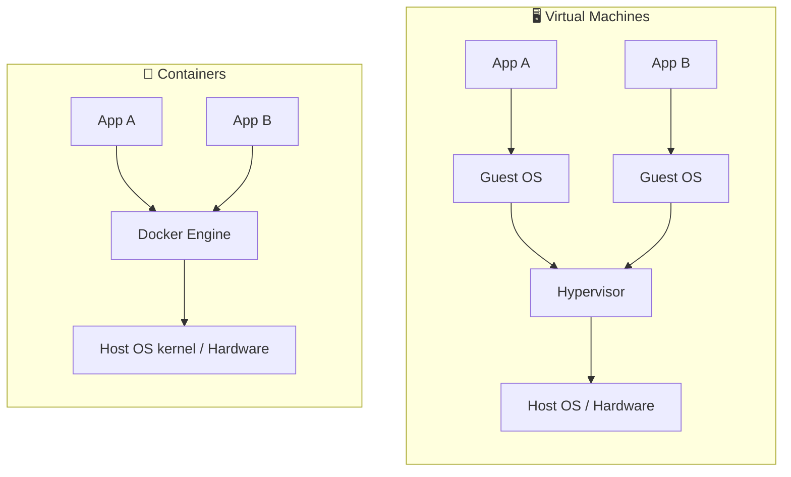
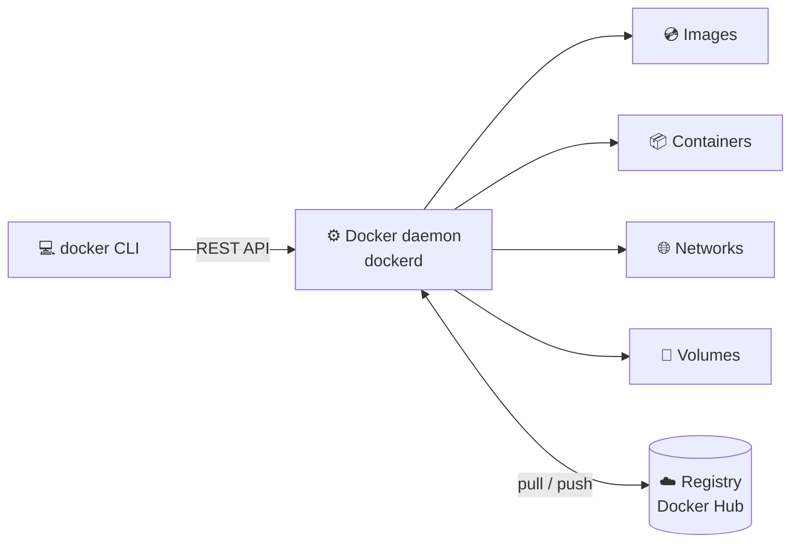
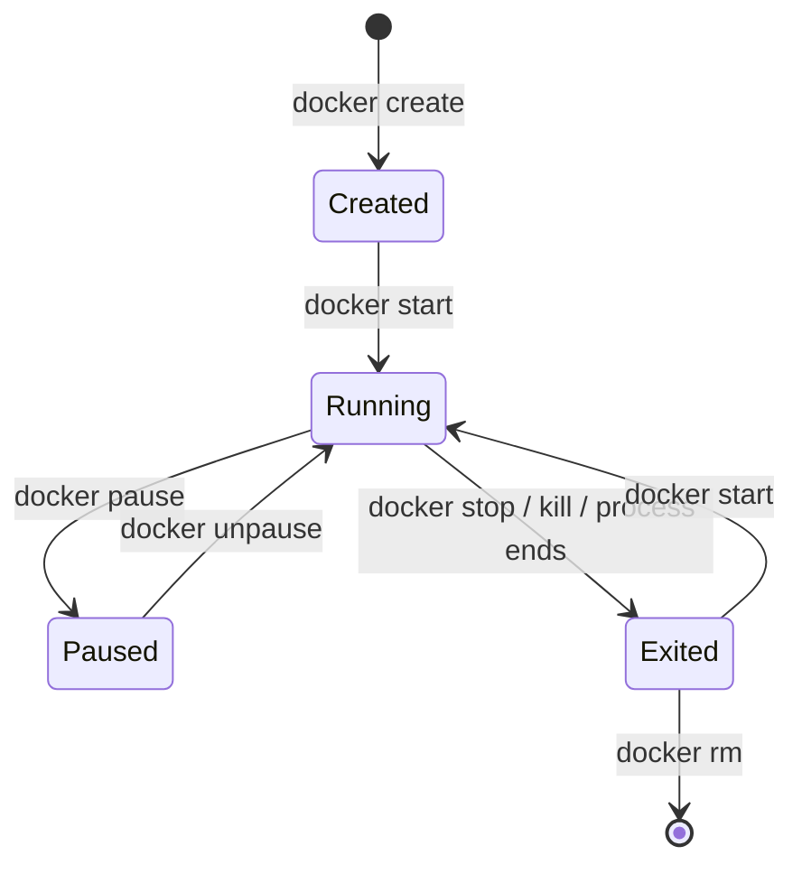

# 🟢 01 · Getting Started

> **Level:** Beginner · **Next:** [02 · Images →](./02-images.md)

## 🤔 Why Docker?

> "It works on my machine" 🤷 → Docker ships **your machine** with the app.

Docker packages an application together with everything it needs (runtime, libraries,
config) into a **container** that runs the same way on any computer.

## 🆚 Containers vs Virtual Machines



| | Virtual Machine | Container |
| :-- | :-- | :-- |
| Isolation | Full guest OS per VM | Shares the host kernel |
| Startup time | Minutes | Seconds or less |
| Size | GBs | MBs |
| Overhead | High | Low |

**How does it work?** On Linux, containers are ordinary processes isolated with kernel features:

- **Namespaces** 🔒 — what a process can *see* (its own PIDs, network, filesystem, hostname…)
- **Control groups (cgroups)** 📏 — what a process can *use* (CPU, memory, I/O)

On macOS and Windows, Docker Desktop runs a small Linux VM to provide that kernel.

## 🧱 Docker Architecture



The `docker` command is just a **client**. The **daemon** does the real work.

## 🛠️ Install & verify

Install [Docker Desktop](https://docs.docker.com/get-docker/) (macOS / Windows) or
[Docker Engine](https://docs.docker.com/engine/install/) (Linux), then:

```sh
docker version          # client + server versions
docker info             # system-wide information
docker run hello-world  # 🎉 your first container
```

What happened behind `docker run hello-world`?

1. The CLI asks the daemon to run the `hello-world` image
2. The daemon can't find it locally → **pulls** it from Docker Hub
3. The daemon **creates** a container from the image and **starts** it
4. The container prints a message and **exits**

## 🔄 Container lifecycle



> `docker run` = `docker pull` (if needed) + `docker create` + `docker start`

## 🎛️ Most useful `docker run` flags

| Flag | Example | What it does |
| :-- | :-- | :-- |
| `-d` | `docker run -d nginx` | Run in the background (detached) |
| `-it` | `docker run -it alpine sh` | Interactive terminal |
| `--name` | `--name web` | Give the container a friendly name |
| `-p` | `-p 8080:80` | Publish a port `host:container` |
| `-e` | `-e NODE_ENV=production` | Set an environment variable |
| `-v` | `-v $(pwd):/app` | Mount a volume / folder |
| `--rm` | `docker run --rm alpine echo hi` | Delete the container when it exits |
| `--restart` | `--restart unless-stopped` | Restart policy |

Try it:

```sh
docker run -d --name web -p 8080:80 nginx   # start NGINX
curl http://localhost:8080                  # 👋 Welcome to nginx!
docker logs web                             # see the access log
docker stop web && docker rm web            # clean up
```

## 🧹 Cleaning up

| Command | Removes |
| :-- | :-- |
| `docker rm <container>` | A stopped container (`-f` to force a running one) |
| `docker container prune` | All stopped containers |
| `docker image prune` | Dangling (untagged) images |
| `docker image prune -a` | All images not used by a container |
| `docker volume prune` | Unused volumes ⚠️ data loss |
| `docker system prune` | Stopped containers, unused networks, dangling images, build cache |
| `docker system df` | 📊 Show how much disk Docker is using |

## ✅ Checkpoint

- [ ] I can explain the difference between an image and a container
- [ ] I can run, list, stop and remove containers
- [ ] I can publish a port and open the app in my browser

---

[🏠 Home](../README.md) · [02 · Images →](./02-images.md)
