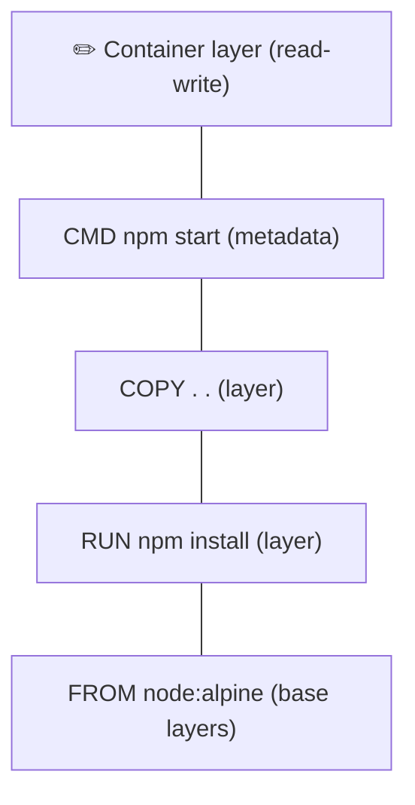

# 💿 02 · Images

> **Level:** Beginner · [← 01 · Getting Started](./01-getting-started.md) · [03 · Dockerfile →](./03-dockerfile.md)

## 🧅 Images are made of layers

An image is a stack of **read-only layers**. Each Dockerfile instruction that changes the
filesystem creates a new layer. When a container starts, Docker adds a thin **writable layer**
on top.



Why it matters:

- ♻️ **Sharing** — 10 images built on `node:alpine` store its layers only once
- ⚡ **Caching** — unchanged layers are reused on rebuild
- 🗑️ **Ephemeral** — anything written in the container layer is lost when the container is removed (use [volumes](./04-data-and-volumes.md)!)

## 🏷️ Image names & tags

```
docker.io / n4sunday / docker-react : 1.0.0
└registry┘ └namespace┘ └repository┘  └ tag ┘
```

- No registry → defaults to `docker.io` (Docker Hub)
- No namespace → defaults to `library` (official images, e.g. `nginx`)
- No tag → defaults to `latest` ⚠️ `latest` is just a name, **not** "the newest version"

Pin versions for reproducible builds:

```dockerfile
FROM node:22-alpine        # ✅ major version pinned
FROM node:22.11.0-alpine   # ✅✅ exact version
FROM node                  # ❌ could change any time
```

## 🧰 Image commands

| Command | Description |
| :-- | :-- |
| `docker pull nginx:1.27` | Download an image |
| `docker image ls` | List local images |
| `docker image rm <image>` | Delete an image (alias: `docker rmi`) |
| `docker tag <src> <dst>` | Add a new name to an image |
| `docker push <image>` | Upload to a registry (`docker login` first) |
| `docker history <image>` | Show the layers and their sizes |
| `docker image inspect <image>` | Full metadata as JSON |
| `docker save -o app.tar <image>` | Export an image to a file |
| `docker load -i app.tar` | Import an image from a file |

## 🚀 Share your image on Docker Hub

```sh
docker login
docker build -t <your-docker-id>/hello:1.0 .
docker push <your-docker-id>/hello:1.0

# anyone, anywhere:
docker run <your-docker-id>/hello:1.0
```

## 🪶 Choosing a base image

| Variant | Example | Size | Notes |
| :-- | :-- | :-- | :-- |
| Full | `node:22` | ~1 GB | Debian + build tools, easiest to debug |
| Slim | `node:22-slim` | ~200 MB | Debian minus extras — good default |
| Alpine | `node:22-alpine` | ~150 MB | musl libc, very small, occasional native-module issues |
| Distroless | `gcr.io/distroless/nodejs22-debian12` | ~130 MB | No shell or package manager — great for production |
| Scratch | `scratch` | 0 MB | Empty — for static binaries (Go, Rust) |

> [!TIP]
> Smaller images = faster pulls + fewer packages that can have vulnerabilities.

## 📸 Bonus: `docker commit`

You *can* create an image from a running container:

```sh
docker run -it alpine sh        # install things manually inside...
docker commit <container-id> my-alpine:manual
```

> [!WARNING]
> Prefer a Dockerfile — `commit` isn't reproducible and nobody can see how the image was made.

## ✅ Checkpoint

- [ ] I understand image layers and why caching works
- [ ] I can tag and push an image to Docker Hub
- [ ] I can choose a sensible base image

---

[← 01 · Getting Started](./01-getting-started.md) · [🏠 Home](../README.md) · [03 · Dockerfile →](./03-dockerfile.md)
