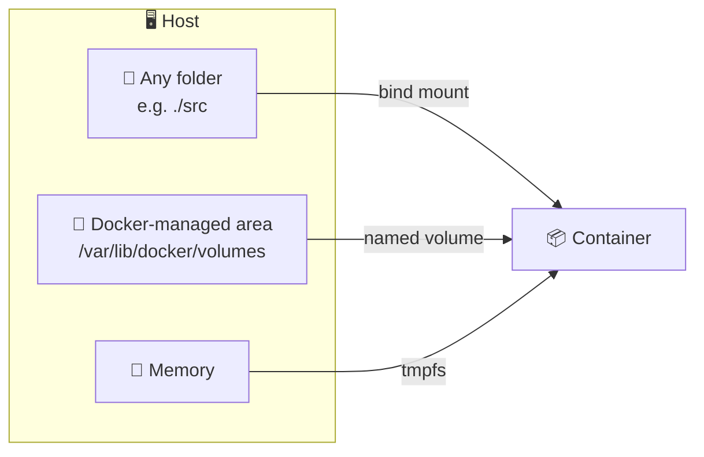

# 💾 04 · Data & Volumes

> **Level:** Intermediate · [← 03 · Dockerfile](./03-dockerfile.md) · [05 · Networking →](./05-networking.md)

Containers are **disposable**. Anything written to the container's writable layer disappears
with `docker rm`. To keep data, store it **outside** the container.

## 🗄️ Three ways to mount data



| Type | Managed by | Best for |
| :-- | :-- | :-- |
| **Named volume** | Docker | 🗃️ Databases, persistent app data |
| **Bind mount** | You (a host path) | 💻 Live-editing source code in development |
| **tmpfs** | Memory only | 🔐 Temporary or sensitive data that must never hit disk |

## 🗃️ Named volumes

```sh
docker volume create pgdata

docker run -d --name db \
  -e POSTGRES_PASSWORD=secret \
  -v pgdata:/var/lib/postgresql/data \
  postgres:17

docker rm -f db            # 💥 container gone...
docker run -d --name db -e POSTGRES_PASSWORD=secret \
  -v pgdata:/var/lib/postgresql/data postgres:17   # ...data still there ✅
```

| Command | Description |
| :-- | :-- |
| `docker volume ls` | List volumes |
| `docker volume inspect <vol>` | Show details (including mount point) |
| `docker volume rm <vol>` | Delete a volume |
| `docker volume prune` | Delete all unused volumes ⚠️ |

## 📁 Bind mounts

```sh
# short syntax
docker run -v $(pwd):/app node:22-alpine

# long syntax (more explicit, recommended)
docker run --mount type=bind,source="$(pwd)",target=/app node:22-alpine

# read-only
docker run -v $(pwd)/config:/etc/app:ro my-app
```

> [!TIP]
> The anonymous volume trick from the main README — `-v /app/node_modules` — stops the bind
> mount from hiding the `node_modules` installed inside the image.

## 🧠 tmpfs

```sh
docker run --tmpfs /tmp:rw,size=64m my-app
```

## 🧳 Backup & restore a volume

```sh
# backup: tar the volume into the current folder
docker run --rm -v pgdata:/data -v $(pwd):/backup alpine \
  tar czf /backup/pgdata.tar.gz -C /data .

# restore
docker run --rm -v pgdata:/data -v $(pwd):/backup alpine \
  tar xzf /backup/pgdata.tar.gz -C /data
```

## 📤 Copy files in and out

```sh
docker cp <container>:/app/logs/app.log ./app.log
docker cp ./config.json <container>:/app/config.json
```

## ✅ Checkpoint

- [ ] I know when to use a named volume vs a bind mount
- [ ] My database data survives `docker rm`
- [ ] I can back up and restore a volume

---

[← 03 · Dockerfile](./03-dockerfile.md) · [🏠 Home](../README.md) · [05 · Networking →](./05-networking.md)
