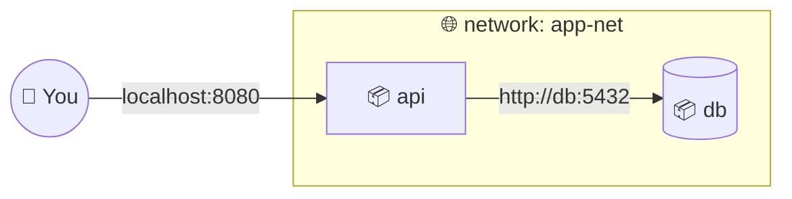

# 🌐 05 · Networking

> **Level:** Intermediate · [← 04 · Data & Volumes](./04-data-and-volumes.md) · [06 · Docker Compose →](./06-docker-compose.md)

## 🔌 Network drivers

| Driver | Description | Use case |
| :-- | :-- | :-- |
| `bridge` | Private network on one host (default) | Most single-host apps |
| `host` | Share the host's network stack, no isolation | Max performance (Linux only) |
| `none` | No networking | Fully isolated jobs |
| `overlay` | Network spanning multiple hosts | Docker Swarm |
| `macvlan` | Container gets its own MAC/IP on your LAN | Legacy apps that need a real LAN IP |

## 🏷️ Use a user-defined bridge network

The **default** bridge network has no DNS — containers can only reach each other by IP.
A **user-defined** network gives you automatic DNS by **container name**. 🎉



```sh
docker network create app-net

docker run -d --name db  --network app-net -e POSTGRES_PASSWORD=secret postgres:17
docker run -d --name api --network app-net -p 8080:3000 my-api

# inside "api", the database is reachable at host "db" 🎯
docker exec -it api ping db
```

> Docker Compose creates a network like this for you automatically —
> that's why `redis-server` works as a hostname in [`multiple-container`](../multiple-container).

## 🚪 Publishing ports

| Flag | Meaning |
| :-- | :-- |
| `-p 8080:80` | Host port 8080 → container port 80, on **all** host interfaces |
| `-p 127.0.0.1:8080:80` | Only reachable from your own machine 🔒 |
| `-p 8080:80/udp` | UDP instead of TCP |
| `-P` | Publish every `EXPOSE`d port on a random host port |

```sh
docker port <container>   # show the port mappings
```

> [!WARNING]
> Containers on the same network can already talk to each other on **any** port.
> Only publish (`-p`) the ports that need to be reached from **outside** — e.g. don't
> publish your database in production.

## 🏠 Reaching the host from a container

```sh
# Docker Desktop (macOS / Windows): works out of the box
curl http://host.docker.internal:3000

# Linux: add the mapping yourself
docker run --add-host=host.docker.internal:host-gateway my-app
```

## 🧰 Network commands

| Command | Description |
| :-- | :-- |
| `docker network ls` | List networks |
| `docker network create <name>` | Create a bridge network |
| `docker network inspect <name>` | See connected containers & IPs |
| `docker network connect <net> <container>` | Attach a running container |
| `docker network disconnect <net> <container>` | Detach it |
| `docker network rm <name>` | Delete a network |

## ✅ Checkpoint

- [ ] I put related containers on a user-defined network and use names, not IPs
- [ ] I only publish the ports that need outside access
- [ ] I can reach a service on my host from inside a container

---

[← 04 · Data & Volumes](./04-data-and-volumes.md) · [🏠 Home](../README.md) · [06 · Docker Compose →](./06-docker-compose.md)
