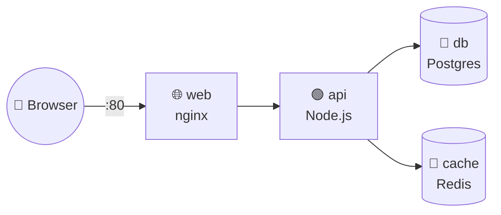

# 🧩 06 · Docker Compose in Depth

> **Level:** Intermediate · [← 05 · Networking](./05-networking.md) · [07 · Best Practices & Security →](./07-best-practices-and-security.md)

The [main README](../README.md#-3-docker-compose--multiple-containers) covers the basics.
This chapter shows a **realistic full-stack setup**.

## 🏗️ A full-stack example



📄 **`compose.yaml`**

```yaml
services:
  web:
    image: nginx:1.27-alpine
    ports:
      - "80:80"
    volumes:
      - ./nginx/default.conf:/etc/nginx/conf.d/default.conf:ro
    depends_on:
      - api

  api:
    build:
      context: ./api
      target: runtime            # build a specific stage of a multi-stage Dockerfile
    env_file: .env
    environment:
      DATABASE_URL: postgres://app:${DB_PASSWORD}@db:5432/app
      REDIS_URL: redis://cache:6379
    depends_on:
      db:
        condition: service_healthy
      cache:
        condition: service_started
    restart: unless-stopped

  db:
    image: postgres:17-alpine
    environment:
      POSTGRES_USER: app
      POSTGRES_PASSWORD: ${DB_PASSWORD}
      POSTGRES_DB: app
    volumes:
      - pgdata:/var/lib/postgresql/data
    healthcheck:
      test: ["CMD-SHELL", "pg_isready -U app"]
      interval: 5s
      timeout: 3s
      retries: 10

  cache:
    image: redis:7-alpine

volumes:
  pgdata:
```

📄 **`.env`** (⚠️ add it to `.gitignore`)

```sh
DB_PASSWORD=change-me
```

> [!NOTE]
> Compose reads `.env` next to the compose file automatically for `${VARIABLE}` substitution.
> `env_file:` additionally passes the variables **into** the container.

## ⏱️ Startup order with healthchecks

`depends_on` alone only waits for the container to **start**, not for the app inside to be
**ready**. Combine it with a `healthcheck` and `condition: service_healthy` (as above) so the
API doesn't crash because Postgres is still booting.

## 🧩 Multiple files & environments

```
compose.yaml            # shared base
compose.override.yaml   # dev tweaks — loaded automatically
compose.prod.yaml       # production tweaks
```

```sh
docker compose up                                        # base + override
docker compose -f compose.yaml -f compose.prod.yaml up -d # base + prod
docker compose config                                    # 🔍 print the merged result
```

## 🎚️ Profiles — optional services

```yaml
services:
  adminer:
    image: adminer
    ports: ["8081:8080"]
    profiles: [tools]
```

```sh
docker compose up                    # adminer is NOT started
docker compose --profile tools up    # adminer is started
```

## 👀 `docker compose watch` — modern hot reload

Instead of bind mounts, Compose can sync files into the container for you:

```yaml
services:
  api:
    build: ./api
    develop:
      watch:
        - action: sync           # copy changed files into the container
          path: ./api/src
          target: /app/src
        - action: rebuild        # rebuild the image when dependencies change
          path: ./api/package.json
```

```sh
docker compose watch
```

## 🧰 Everyday commands

| Command | Description |
| :-- | :-- |
| `docker compose up -d --build` | Build and start everything in the background |
| `docker compose ps` | Status of each service |
| `docker compose logs -f api` | Follow logs of one service |
| `docker compose exec api sh` | Shell into a running service |
| `docker compose run --rm api npm test` | One-off command in a new container |
| `docker compose restart api` | Restart one service |
| `docker compose up -d --scale api=3` | Run 3 replicas (remove `container_name`/fixed host ports first) |
| `docker compose down` | Stop and remove containers & networks |
| `docker compose down -v` | …and delete volumes ⚠️ |

## ✅ Checkpoint

- [ ] My services start in the right order thanks to healthchecks
- [ ] Secrets live in `.env`, which is not committed
- [ ] I can run different configurations for dev and prod

---

[← 05 · Networking](./05-networking.md) · [🏠 Home](../README.md) · [07 · Best Practices & Security →](./07-best-practices-and-security.md)
