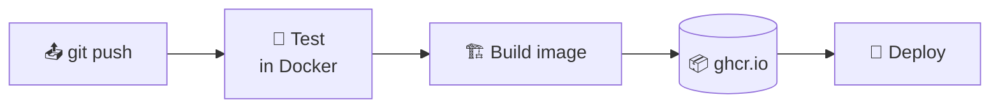
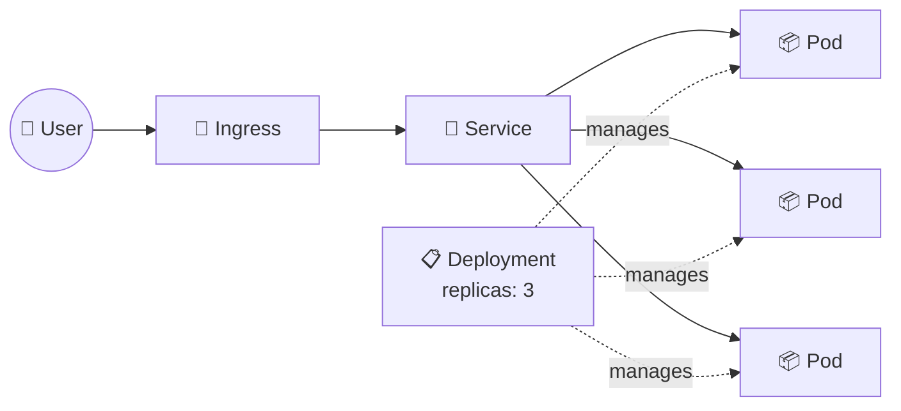

# ☸️ 10 · CI/CD & Orchestration

> **Level:** Advanced · [← 09 · Advanced Docker](./09-advanced.md) · [🏠 Home](../README.md)

## 🔄 CI/CD with GitHub Actions

The repo's [`production-grade-workflow`](../production-grade-workflow) uses Travis CI. Here is
the same idea with **GitHub Actions** — test, then build & push an image to GitHub Container
Registry on every push to `main`.



📄 **`.github/workflows/docker.yml`**

```yaml
name: docker

on:
  push:
    branches: [main]
  pull_request:

jobs:
  test:
    runs-on: ubuntu-latest
    steps:
      - uses: actions/checkout@v4
      - name: Run tests in a container
        working-directory: production-grade-workflow
        run: |
          docker build -t app-test -f Dockerfile.dev .
          docker run -e CI=true app-test npm test

  build-and-push:
    needs: test
    if: github.ref == 'refs/heads/main'
    runs-on: ubuntu-latest
    permissions:
      contents: read
      packages: write
    steps:
      - uses: actions/checkout@v4
      - uses: docker/setup-qemu-action@v3      # for multi-platform builds
      - uses: docker/setup-buildx-action@v3
      - uses: docker/login-action@v3
        with:
          registry: ghcr.io
          username: ${{ github.actor }}
          password: ${{ secrets.GITHUB_TOKEN }}
      - uses: docker/build-push-action@v6
        with:
          context: production-grade-workflow
          platforms: linux/amd64,linux/arm64
          push: true
          tags: |
            ghcr.io/${{ github.repository }}:latest
            ghcr.io/${{ github.repository }}:${{ github.sha }}
          cache-from: type=gha
          cache-to: type=gha,mode=max
```

## 🐝 Docker Swarm — orchestration built into Docker

The simplest step from Compose to a cluster. Reuses your `compose.yaml`.

```sh
docker swarm init                                  # make this machine a manager
docker stack deploy -c compose.yaml myapp          # deploy the stack
docker service ls                                  # list services
docker service scale myapp_api=5                   # scale up
docker service update --image my-app:2.0 myapp_api # rolling update
```

```yaml
services:
  api:
    image: my-app:1.0
    deploy:
      replicas: 3
      update_config:
        parallelism: 1
        delay: 10s
      restart_policy:
        condition: on-failure
```

## ☸️ Kubernetes

The industry standard for running containers at scale.

| Docker / Compose | Kubernetes |
| :-- | :-- |
| Container | **Pod** (one or more containers) |
| Service with `replicas` | **Deployment** (manages Pods, rolling updates) |
| Port / service name DNS | **Service** (stable IP & DNS name for Pods) |
| `-p 80:80` to the outside | **Ingress** / `LoadBalancer` Service |
| `environment` / `.env` | **ConfigMap** / **Secret** |
| Named volume | **PersistentVolumeClaim** |



📄 **`k8s/app.yaml`**

```yaml
apiVersion: apps/v1
kind: Deployment
metadata:
  name: web
spec:
  replicas: 3
  selector:
    matchLabels:
      app: web
  template:
    metadata:
      labels:
        app: web
    spec:
      containers:
        - name: web
          image: n4sunday/docker-react:latest
          ports:
            - containerPort: 80
          resources:
            limits:
              memory: "128Mi"
              cpu: "250m"
          readinessProbe:
            httpGet:
              path: /
              port: 80
---
apiVersion: v1
kind: Service
metadata:
  name: web
spec:
  type: NodePort
  selector:
    app: web
  ports:
    - port: 80
      targetPort: 80
      nodePort: 31515
```

Try it locally with **minikube**:

```sh
minikube start
kubectl apply -f k8s/app.yaml
kubectl get pods,svc               # wait until pods are Running
minikube service web               # 🌐 opens the app in your browser
```

### 🧰 kubectl cheat sheet

| Command | Description |
| :-- | :-- |
| `kubectl get pods -o wide` | List pods with node & IP |
| `kubectl describe pod <pod>` | Events & details (why is it failing?) |
| `kubectl logs -f <pod>` | Follow logs |
| `kubectl exec -it <pod> -- sh` | Shell into a pod |
| `kubectl apply -f <file>` | Create / update resources |
| `kubectl delete -f <file>` | Delete resources |
| `kubectl scale deployment web --replicas=5` | Scale |
| `kubectl set image deployment/web web=<image>:2.0` | Rolling update |
| `kubectl rollout undo deployment/web` | ⏪ Roll back |
| `kubectl port-forward svc/web 8080:80` | Reach a service from your machine |

## 🎓 Where to go next

- 📦 **Helm** — package & template Kubernetes manifests
- 🔁 **GitOps** with Argo CD or Flux
- 📈 **Observability** — Prometheus, Grafana, OpenTelemetry
- ☁️ Managed Kubernetes — EKS, GKE, AKS

---

[← 09 · Advanced Docker](./09-advanced.md) · [🏠 Home](../README.md)
